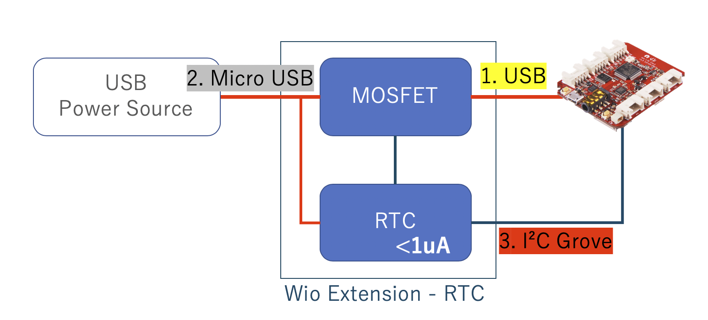

# Wio Extension - RTC


The Wio Extension - RTC is an extension board for [Wio LTE](https://www.seeedstudio.com/tag/WIO-LTE.html). With Wio Extension - RTC, you can extend runtime of battery operated ( Internet of ) Things so easily.


Wio Extension - RTC has NXP PCF8523 Real-Time Clock (RTC), and PCF8523 control the power supply for the USB connector. When the power supply to Wio boards ( 1. USB in the picture above ), the standby current of whole system is less than 1 uA.



# Sample code
The sample code for Wio Extension - RTC works on Wio LTE and its Seeed Japan office software library for Arduino.
## Pre Requirements
### Board Support
Open your Arudino IDE, click on File > Preferences, and copy below url to Additional Boards Manager URLs.  
`http://www.seeed.co.jp/package_SeeedJP_index.json`  
  

Click on Toos > Board > Board Manager, and enter `Wio` to the text box.


Click `Seeed STM32F4 Board(JP mirror) by Seeed K.K.` then an Install button appear, click on it to finish the step, this process takes about 5 minutes to half an hour, which depend on the speed of your network.

### Library for Wio LTE
Click on Tools > Manage Libraries, and enter `Wio` to the text box.


Click `Wio LTE for Arduino by Seeed K.K.` then an Install button appear, click on it to finish the step.

### Grove modules
Connect [Grove - Buzzer](https://www.seeedstudio.com/Grove-Buzzer-p-768.html) or [Grove - Red LED](https://www.seeedstudio.com/Grove-Red-LED-p-1142.html) to D38 of Wio LTE.

## Sample sketch
Unzip the [sample sketch](https://github.com/Seeed-Studio/Wio_Extension_RTC/raw/master/wiortc-sample.zip), and open `wiortc-sample.ino` with Arduino IDE.
As you can read from the sample sketch, Wio Extension - RTC set to shut down the system for 30 sec on
```
RTC.SetWakeupPeriod(BOOT_INTERVAL);
```
and then set to shut down the whole system on
```
RTC.Shutdown();
```

# Tips
## Power source
When you use mobile battery as the power source of the system, you need to choose **non smart** power bank. Typical mobile battery have automatic power off function. And the battery shut off the power supply itself when Wio Entension - RTC enters stand-by, since its stand-by current less than 1 uA and it's too weak for the threshold of the battery.
## For non Wio LTE Boards
Since Wio Extension - RTC just controlling USB power supply set from I2C, you can use this board to manage the power supply almost for every MCU boards powering from USB.
